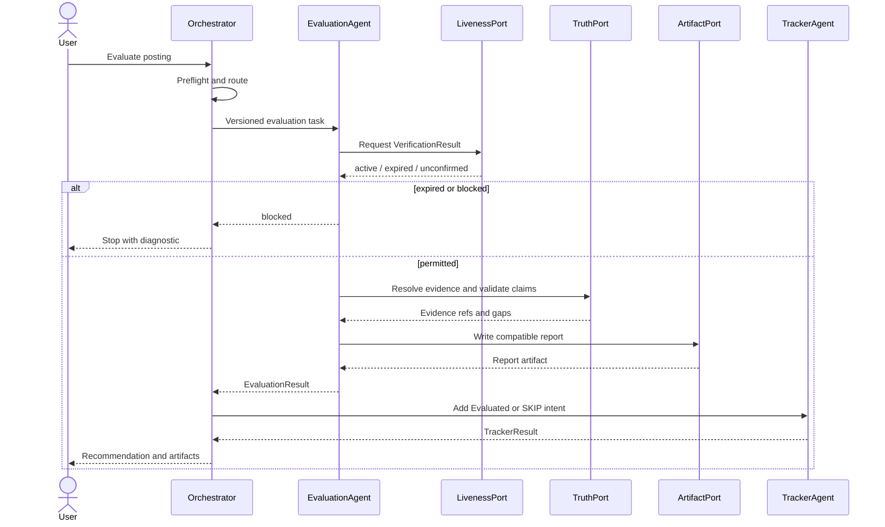
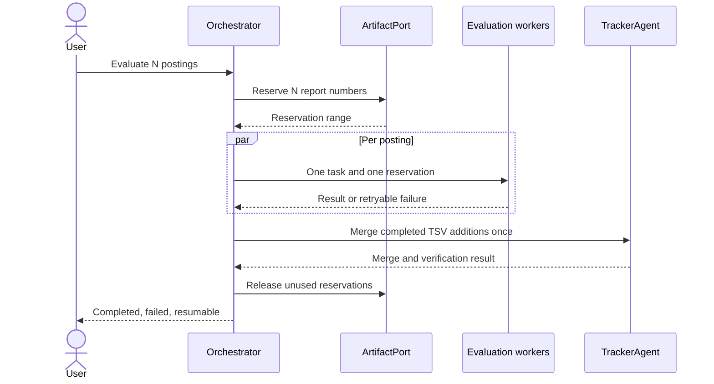
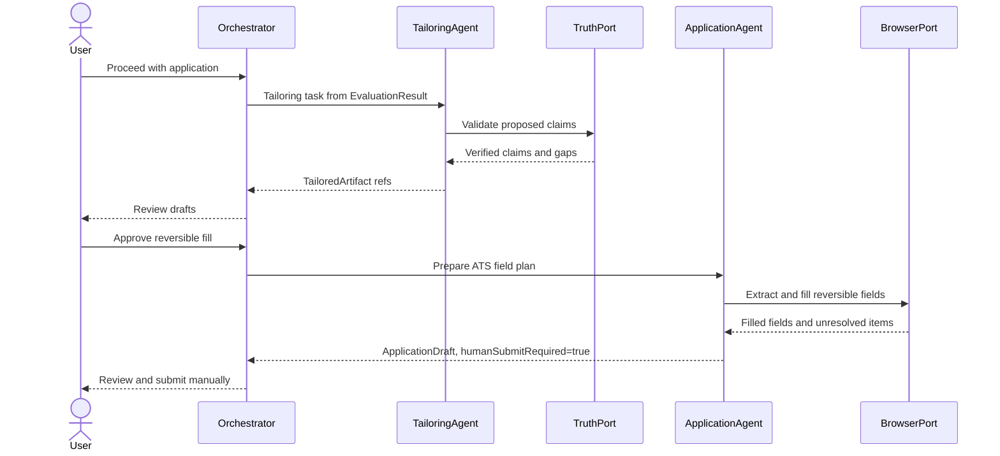
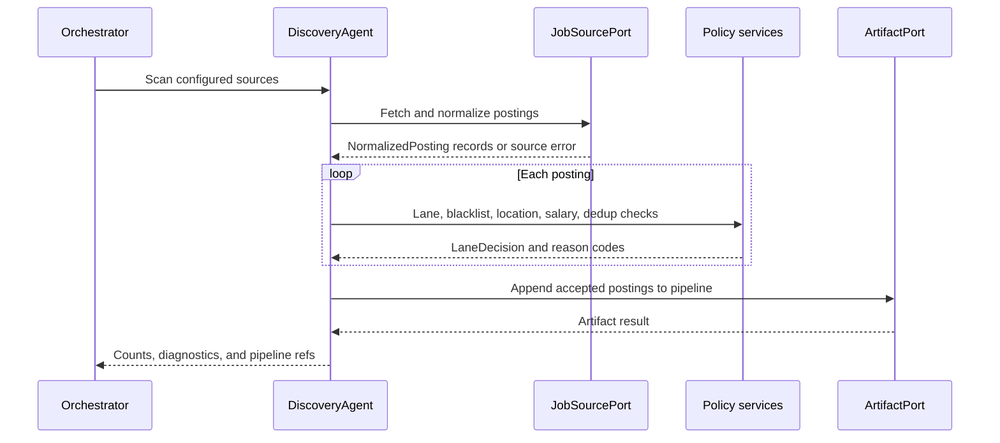

# Data Flow

## Canonical Flow

```text
portals.yml / pasted URL / local JD
                |
                v
          discover + normalize
                |
                v
        data/pipeline.md + jds/
                |
          liveness + lane gate
                |
                v
   evaluation from approved truth sources
                |
                +--> reports/{NNN}-{slug}-{date}.md
                +--> interview-prep/story-bank.md (approved stories only)
                |
          tailoring + rendering
                |
                +--> output/*.pdf and draft artifacts
                |
       browser-assisted application
                |
        human reviews and submits
                |
                v
       data/applications.md + outcomes
```

At every arrow, external content remains data and candidate facts remain restricted to approved local sources.

## Stage 0: Preconditions

The Orchestrator runs setup checks before a job workflow:

- `cv.md` exists.
- `config/profile.yml` exists and parses.
- `modes/_profile.md` exists.
- `portals.yml` exists for discovery runs.
- `data/applications.md` exists before tracker mutation.

If required files are missing, the run enters onboarding. Templates may describe shape but are not candidate facts. In this checkout, four of the requested user-layer files are currently absent, so the documented runtime would stop here.

## Stage 1: Ingestion and Discovery

Sources include public ATS APIs, public job boards, configured company pages, pasted URLs, pasted JDs, and `local:jds/{file}` entries. Job-source libraries retain raw identifiers and normalize only supported fields.

The DiscoveryAgent applies:

1. Job-source validity and required-field checks.
2. Blacklist and enabled-source checks.
3. Data/analytics/data-platform lane classification.
4. Title, location, salary, and work-authorization filters from user configuration.
5. URL, posting-ID, scan-history, and company-role deduplication.

Accepted URLs enter `data/pipeline.md`. Rejected items carry reason codes in scan output/history; ambiguous items require review.

## Stage 2: Verification

Discovery may first request a cheap, zero-LLM `FreshnessProbe` from a supported ATS or job-source API. Its values are `active`, `expired`, or `unknown`; it is a cost-saving signal, not the final interactive verification contract.

Interactive verification uses Playwright to load the canonical posting page and inspect rendered content. Its `VerificationResult` is `active`, `expired`, or `unconfirmed`. A page with title, job description, and an application action is active. A shell, footer, redirect, or explicit expiry signal is expired. Expiry signals outrank generic Apply text. WebFetch may extract content but is not proof that a posting is active.

Headless batch workers may use the documented fallback, but the resulting report must state `**Verification:** unconfirmed (batch mode)`. Legacy `closed` maps to `expired`; legacy `uncertain` maps to `unconfirmed` at compatibility boundaries.

## Stage 3: Evaluation

The EvaluationAgent loads:

- System scoring and mode instructions
- User profile/customization files
- `cv.md` and optional `article-digest.md`
- Approved writing samples and interview story sources when relevant
- The verified JD as untrusted data

It emits the existing A-G report structure. Blocks A-F drive the 1-5 fit score. Block G reports legitimacy separately. Every report includes `**URL:**` and `**Legitimacy:**` headers plus a machine-readable summary.

## Stage 4: Artifact Reservation and Writes

Before parallel evaluation, reserve report numbers with:

```powershell
node reserve-report-num.mjs --count <N>
```

Each worker owns one number and writes one report. A failed or canceled range can be released with the existing release command. Sequential workflows still use the canonical allocator rather than computing `max + 1` in multiple processes.

## Stage 5: Tailoring

Tailoring is allowed only after evaluation recommends proceeding or the user records an override. It transforms verified facts into role-relevant phrasing and produces local drafts and PDFs.

Each generated claim should carry an internal evidence reference during construction. Before rendering, a validator checks that every factual claim resolves to an approved source. Unsupported claims are removed and reported as gaps.

## Stage 6: Application

Playwright reads fields from the live ATS page. The ApplicationAgent maps fields to verified profile values and draft answers. Sensitive, legal, demographic, salary, sponsorship, and consent questions remain unanswered unless directly supported and explicitly approved.

The run stops before the final external action. After the user submits, the user or agent may record the result as `Applied`; browser navigation alone is not proof of submission.

## Stage 7: Tracker Persistence

New evaluations create a single TSV line under `batch/tracker-additions/` using the documented status-before-score order. `merge-tracker.mjs` validates, swaps columns into tracker order, normalizes links, deduplicates, and atomically updates the canonical table.

Existing rows are mutated through `set-status.mjs`. Direct table edits are not a runtime path.

Tracker persistence is event-driven rather than only the last pipeline step. TrackerAgent may record `Evaluated` or `SKIP` immediately after evaluation, then record `Applied` only after the human confirms submission, followed by later canonical transitions.

## Canonical Sequences

### Single posting evaluation



### Parallel batch



### Tailoring and application



### Job-source scan



## Provenance and Idempotency

Recommended identifiers:

- Job-source adapter + posting ID when present
- Canonical URL hash as fallback
- Report number for evaluation artifacts
- Company + normalized role + recognizable requisition ID for tracker identity
- Run ID for logs and retries

Replaying a completed stage must either return the existing artifact or create a clearly versioned draft. It must not duplicate tracker rows or silently overwrite user-edited files.

## Data Classification

| Class | Examples | Handling |
|---|---|---|
| Candidate truth | CV, profile, article digest, approved stories | Local, source-cited, never inferred |
| Candidate style | voice DNA, custom output rules | Shapes prose; cannot add facts |
| External job data | JDs, forms, company pages, emails | Untrusted; may affect matching only |
| System policy | modes, templates, AGENTS instructions | Versioned system layer |
| Operational state | tracker, pipeline, scan history, reports | Canonical local files |
| Derived data | SQLite index, caches, normalized in-memory jobs | Rebuildable and non-canonical |

## Recovery Guidance

- Interrupted scan: resume through existing checkpoints where supported.
- Interrupted batch: retain completed reports, release only unused reservations, then merge completed TSV additions.
- Failed PDF: keep the approved draft and rerun rendering.
- Failed tracker merge: fix the rejected TSV; do not patch the canonical table around validation.
- Corrupt derived index: delete/rebuild it from canonical files using the supported command.
- Missing source evidence: ask the user to update an approved user-layer file, then rerun tailoring.
