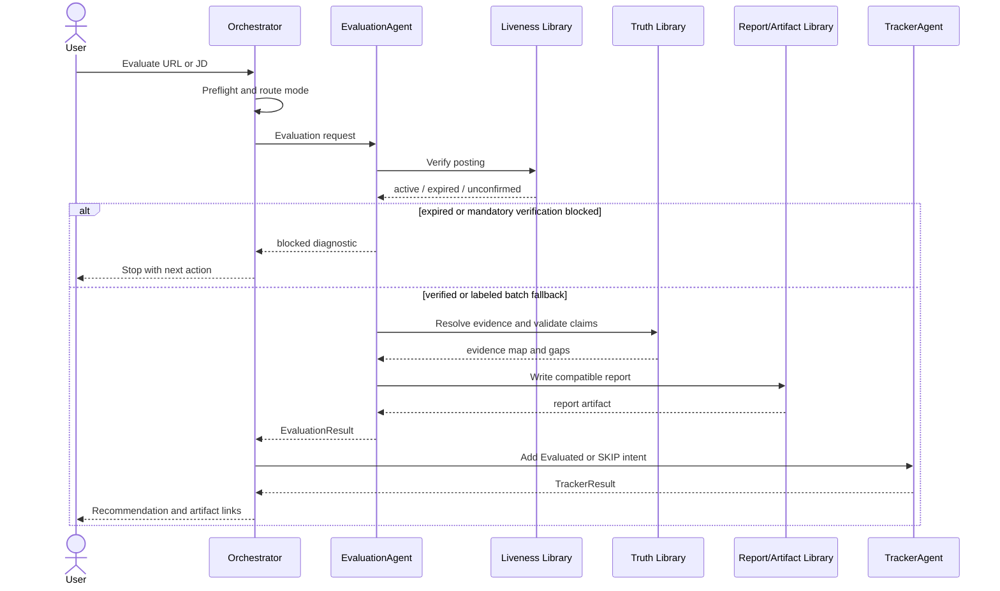
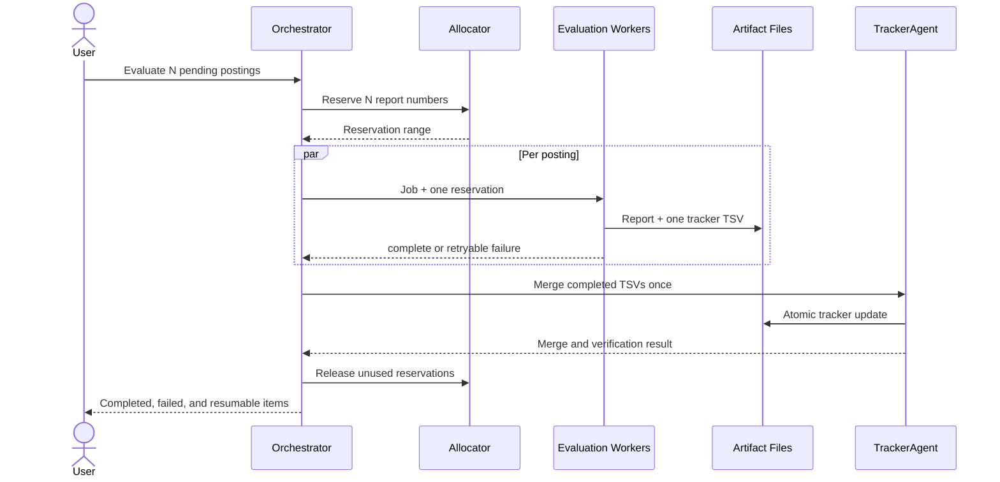

# Architecture Review

## Review Scope

This review covers all 28 Markdown documents present under `docs/` at the time of review:

- The target-design suite: `00_VISION.md` through `09_TESTING.md`, plus `ROADMAP.md`
- Existing runtime and operator documentation: `ARCHITECTURE.md`, `SCRIPTS.md`, `SETUP.md`, `CODEX.md`, `SUPPORTED_CLIS.md`, `SUPPORTED_JOB_BOARDS.md`, `APPLY_AUTOFILL.md`, `AUTOMATION.md`, `RUNNING_ON_A_BUDGET.md`, `CUSTOMIZATION.md`, `FAQ.md`, `FREE_TIER.md`, `COWORK.md`, `local-parser-cookbook.md`, `PLUGINS.md`, `PLUGIN_REVIEW.md`, and `REVIEWING.md`

Images, GIFs, and SVG assets in `docs/` are not architecture documents and were not treated as normative text.

This is a documentation-only review. It does not assert that target-design components already exist, and it does not recommend changing the established user/system data boundary, canonical file formats, or human approval requirement.

## Executive Assessment

The architecture has a sound core: local-first files, a strict truth boundary, deterministic scripts, public-source provider adapters, guarded tracker writes, and mandatory human submission. The proposed six-agent model can fit this foundation without a rewrite.

The main risk is not insufficient capability; it is **a second architecture forming beside the existing one**. The target docs introduce agents, run envelopes, diagnostics, normalized jobs, evidence maps, checkpoints, and OmniRoute adapters, while the existing system already organizes work through modes, root scripts, batch workers, plugins, and file contracts. The documents do not yet define how these two control planes map to one another.

The recommended direction is:

1. Keep the six agents as logical workflow roles.
2. Allow only the Orchestrator to invoke agents.
3. Put policy and deterministic behavior in shared libraries.
4. Treat current modes and root scripts as compatibility adapters.
5. Define one versioned domain model and one vocabulary.
6. Keep Markdown/YAML/TSV canonical and SQLite permanently derived.

No seventh agent is needed.

## Findings Summary

| ID | Severity | Finding |
|---|---|---|
| AR-01 | Critical | Canonical persistence doctrine is contradictory |
| AR-02 | High | Agent responsibilities overlap at several phase boundaries |
| AR-03 | High | Mode, agent, worker, and script orchestration are not mapped |
| AR-04 | High | Interfaces are descriptive rather than implementable contracts |
| AR-05 | High | Core data models are incomplete and unversioned |
| AR-06 | High | Liveness terminology and authority conflict |
| AR-07 | High | The target lane conflicts with generic career-ops customization unless scoped explicitly |
| AR-08 | Medium | Important message-level sequence diagrams are missing |
| AR-09 | Medium | The target design permits latent circular dependencies |
| AR-10 | Medium | File-first scalability limits are acknowledged but not designed through |
| AR-11 | Medium | “Provider” has three distinct meanings |
| AR-12 | Medium | Backward-compatibility details disagree across documents |
| AR-13 | Medium | Local-first and zero-token claims are sometimes too broad |
| AR-14 | Medium | OmniRoute's boundary is intentionally optional but still underspecified |
| AR-15 | Low | Documentation ownership and normative precedence are unclear |

## Detailed Findings

### AR-01 — Canonical persistence doctrine is contradictory

**Evidence**

- `00_VISION.md`, `01_SYSTEM_DESIGN.md`, `03_DATA_FLOW.md`, `04_RUNTIME.md`, `07_TRACKER.md`, and the root architecture doctrine all state that human-readable files are permanently canonical and derived indexes are disposable.
- `SCRIPTS.md` describes a future “Phase 2” in which SQLite may become the source of truth through per-user opt-in.
- The same `SCRIPTS.md` section says tracker writes continue through Markdown, including “hand edits,” while `07_TRACKER.md` and current repository instructions prohibit direct additions and require guarded commands.

**Impact**

A future implementation could create dual-write behavior, divergent tracker state, or a migration path that violates the ecosystem-wide file contract.

**Recommendation**

Make this decision unambiguous: `data/applications.md` remains the permanent canonical tracker; SQLite remains a rebuildable query/index layer. Remove “DB becomes source of truth” from future architecture planning. Define supported Markdown mutations as `merge-tracker.mjs`, `set-status.mjs`, and explicit repair/migration commands—not generic hand edits.

### AR-02 — Agent responsibilities overlap

**Overlaps**

- `TailoringAgent` produces form-answer drafts, while `ApplicationAgent` maps fields and prepares source-grounded answers.
- The Orchestrator enforces the data-lane gate, while `DiscoveryAgent` applies it and the proposed evaluation flow may apply it again.
- `EvaluationAgent` verifies liveness, while Playwright/liveness libraries also own classification and the Orchestrator owns fail-closed gates.
- `DiscoveryAgent` normalizes postings, but `05_PROVIDER_ARCHITECTURE.md` assigns normalization to provider libraries.
- `TrackerAgent` enforces identity, deduplication, locking, and validation, while `07_TRACKER.md` also assigns these to existing tracker scripts/libraries.
- `TailoringAgent` produces artifacts, while browser/rendering libraries own PDF generation and artifact libraries own names/manifests.

**Impact**

The same rule may be implemented in prompts, agents, and scripts. Results will drift by execution path and retries may repeat side effects.

**Recommendation**

Adopt single ownership:

| Responsibility | Owner |
|---|---|
| Workflow ordering and gate decisions | Orchestrator |
| Job-source selection and candidate discovery | DiscoveryAgent |
| Provider parsing/normalization | Provider library |
| Fit analysis and recommendation | EvaluationAgent |
| CV, cover letter, email, and outreach drafting | TailoringAgent |
| ATS field answers, browser mapping, and fill plan | ApplicationAgent |
| Tracker intent and result reporting | TrackerAgent |
| Tracker validation, lock, dedup, and atomic write | Tracker library/current scripts |
| Liveness classification | Liveness library; invoked by EvaluationAgent through Orchestrator policy |
| PDF rendering | Rendering/browser library |
| Claim approval | Truth/policy library |

Remove form answers from TailoringAgent. Agents request deterministic operations; they do not reimplement them.

### AR-03 — No mapping between modes, agents, workers, and scripts

The existing architecture routes user intent to modes such as `scan`, `pipeline`, `oferta`, `pdf`, `apply`, `tracker`, and `batch`. The target architecture routes work through six agents. Batch documentation also calls `batch-runner.sh` an orchestrator and headless CLI processes workers.

There is no normative matrix answering:

- Which agent owns each existing mode?
- Which modes are compositions rather than agent equivalents?
- Which root script is authoritative for each side effect?
- Does a headless worker host one agent, one mode, or a complete mini-orchestrator?
- Can direct script entrypoints bypass agent policy, and if so, which checks must remain inside libraries?

**Recommendation**

Create one mode-to-phase registry in the target design. The essential mappings are:

| Existing mode/entrypoint | Target owner | Notes |
|---|---|---|
| `scan`, `discover` | DiscoveryAgent | Deterministic scanner/provider libraries underneath |
| `oferta`, `triage` | EvaluationAgent | Triage may stop before full evaluation |
| `auto-pipeline`, `pipeline`, `batch` | Orchestrator | Compositions, not specialist agents |
| `pdf`, `cover`, `email`, `contacto` | TailoringAgent | Rendering remains a library |
| `apply` | ApplicationAgent | Always stops before submission |
| `tracker`, `followup`, `reply-watch`, `outcome` | TrackerAgent or explicit non-agent utilities | Decide per command; do not split ownership implicitly |
| `interview*`, `patterns`, `upskill`, `offer-prep` | Existing modes/libraries | Outside the six-phase application path; route explicitly rather than inventing more agents |

### AR-04 — Interfaces are not implementable contracts

The docs name useful interfaces—run envelope, provider operations, agent results, evidence references, tracker commands—but specify them as prose or pseudo-signatures. Missing details include:

- Schema/version field and compatibility rules
- Required versus optional fields
- Serialization format
- Error/diagnostic structure
- Cancellation, timeout, and retry semantics
- Idempotency key scope
- Artifact ownership and overwrite policy
- Trust classification on input fields
- Whether timestamps are event time, fetch time, or local write time
- Async pagination and rate-limit semantics for providers
- How an agent declares requested side effects before they occur

**Recommendation**

Define versioned JSON-schema-equivalent contracts even if the implementation remains plain JavaScript. Every boundary result should be `ok`, `blocked`, `needs_review`, or `retryable_failure`, with structured diagnostics and artifact references. Keep human-facing Markdown as output, not as the only inter-agent protocol.

### AR-05 — Missing data models

The documents partially describe several records but do not establish a single domain model. At minimum, the architecture needs:

| Model | Purpose |
|---|---|
| `RunManifest` | Run identity, mode, phase, checkpoint, policy version, and artifacts |
| `ExternalSourceRef` | URL/provider/raw artifact plus untrusted-data classification |
| `RawPosting` | Immutable provider payload reference and fetch metadata |
| `NormalizedPosting` | Supported normalized fields without inferred values |
| `PostingIdentity` | Provider ID, canonical URL, company/role fallback, and requisition ID |
| `LaneDecision` | Accepted/rejected/review with stable reason codes |
| `LivenessResult` | Canonical status, evidence, method, timestamp, and authority |
| `EvidenceRef` | Approved local source plus stable locator and content fingerprint |
| `Claim` | Proposed text/value, transformation, evidence, and validation state |
| `EvaluationResult` | Score components, legitimacy, gaps, recommendation, and report artifact |
| `TailoredArtifact` | Type, source evaluation, claims, template, version, and output path |
| `ApplicationDraft` | ATS fields, proposed values, evidence, unresolved fields, and submit guard |
| `TrackerCommand` | Add/transition/reconcile intent with idempotency and expected prior state |
| `Diagnostic` | Code, severity, phase, safe message, retryability, and related paths |

`Job`, “candidate,” “posting,” “offer,” and “role” currently overlap. Use `NormalizedPosting` for an external vacancy and reserve `Offer` for the employment-offer tracker stage.

### AR-06 — Liveness terminology and authority conflict

**Conflicts**

- New docs use `active`, `closed`, and `unconfirmed`.
- `SCRIPTS.md` defines `active`, `expired`, and `uncertain`.
- `03_DATA_FLOW.md` makes rendered Playwright verification authoritative for interactive evaluation.
- `SCRIPTS.md` uses ATS API first and treats definitive API results as authoritative without launching a browser.
- Existing architecture text says Playwright/WebFetch extracts the JD, while repository policy distinguishes extraction from mandatory verification.

**Recommendation**

Separate two concepts:

1. `FreshnessProbe`: cheap API/provider signal used during discovery (`active`, `expired`, `unknown`).
2. `VerificationResult`: authoritative pre-evaluation/pre-application result. Interactive runs use rendered Playwright; batch fallback is explicitly `unconfirmed`.

Use one enum in reports and adapters. Map legacy `uncertain` to `unconfirmed` at the boundary. Do not use WebFetch as proof of active status.

### AR-07 — Data-only target lane conflicts with generic customization

The target docs declare data, analytics, and data-platform roles only. Existing docs describe career-ops as role-agnostic and user-customizable, with AI engineering, product, software, marketing, public-sector, and other examples. Provider catalogs are intentionally broad.

This is resolvable, but the current wording can be read as changing shared career-ops behavior for every user, which would violate backward compatibility and the user/system data contract.

**Recommendation**

State that the data-only lane is this checkout's **user-layer policy**, represented in `config/profile.yml`, `modes/_profile.md`, and `portals.yml` after onboarding. The reusable system layer must remain capable of other lanes. The Orchestrator should load a `TargetLanePolicy` from user configuration rather than hardcode data roles in shared libraries.

### AR-08 — Missing sequence diagrams

`docs/ARCHITECTURE.md` contains component and batch-flow diagrams, and `02_AGENT_ARCHITECTURE.md` contains a linear handoff list. Neither is a message-level sequence with gates, artifacts, retries, or human decisions.

At least four sequences are required:

1. Single URL/JD evaluation and tracker registration
2. Parallel batch evaluation with reservation, partial failure, merge, and resume
3. Tailoring/application with truth validation and human submit boundary
4. Provider scan with normalization, lane filter, deduplication, and pipeline write

The first two proposed forms are included below to make the missing interactions concrete.





### AR-09 — Latent circular dependencies

No required runtime cycle is explicitly mandated, but the target design leaves several likely cycles open:

- Orchestrator calls TrackerAgent, while TrackerAgent may run reconciliation that determines what the Orchestrator should resume.
- EvaluationAgent uses truth validation, while the Orchestrator also blocks artifacts based on truth validation.
- DiscoveryAgent invokes provider normalization, while provider/plugin output may feed ingestion hooks that write pipeline state used by DiscoveryAgent.
- Agent wrappers may call root scripts that themselves invoke modes or agent-oriented helpers.
- A run manifest may reference tracker/report artifacts that in turn become the source used to reconstruct the run.

**Recommendation**

Enforce a one-way dependency rule:

```text
VS Code/Codex -> Orchestrator -> Agent ports -> Domain libraries
                                      |              |
                                      v              v
                              Compatibility adapters -> files/external systems
```

Agents never call other agents. Libraries never call agents or modes. Adapters never make policy decisions. The Orchestrator may read results but does not import tracker/provider internals. Run manifests reference canonical artifacts; canonical artifacts do not depend on run manifests for meaning.

### AR-10 — Scalability gaps

**Observed limits**

- `SCRIPTS.md` acknowledges Markdown tracker degradation at hundreds of rows.
- Full ATS discovery may inspect roughly 13,889 distinct Workday/iCIMS hosts and become DNS-bound for about 35 minutes.
- Batch evaluation spawns full CLI workers with repeated prompt/profile context.
- A single merge at batch end is a serialization point and a failure leaves pending TSVs.
- Many analyses rescan all reports and parse legacy Markdown.
- Per-claim evidence maps can expand context substantially if full excerpts are passed between agents.
- `SUPPORTED_JOB_BOARDS.md` is a manually synchronized catalog beside provider modules.

**Recommendation**

- Keep SQLite derived, but use it consistently for queries and incremental read models.
- Add content hashes and schema versions so reports/providers are reparsed only when changed.
- Pass evidence IDs and bounded excerpts, not entire truth files, across every phase.
- Use bounded worker pools with provider/model rate-limit budgets.
- Merge completed TSVs in deterministic checkpoints, not only after a large fan-out, while retaining the one-writer lock.
- Generate provider capability documentation/tests from the registry where feasible.
- Separate scan breadth from evaluation concurrency; they have different bottlenecks.

### AR-11 — “Provider” is overloaded

The docs use provider for:

1. Job-source adapters under `providers/`
2. Model/API vendors such as OpenRouter, OpenAI-compatible services, and Ollama
3. The plugin `provider` hook

This makes `ProviderConfig`, provider errors, and OmniRoute provider selection ambiguous.

**Recommendation**

Use:

- `JobSourceAdapter` for ATS/job-board modules
- `ModelBackend` for LLM endpoints
- `PluginHook.provider` only as the legacy manifest value, mapped internally to `JobSourceAdapter`

Diagnostics should use namespaces such as `JOB_SOURCE_*`, `MODEL_BACKEND_*`, and `PLUGIN_*`.

### AR-12 — Backward-compatibility details disagree

Examples include:

- Score cells documented as `X.X/5` in new tracker docs versus `X.XX/5` in `SCRIPTS.md`; actual compatibility may need to accept both while emitting one canonical precision.
- `DUP` appears as an accepted verification score in `SCRIPTS.md`, while the current tracker contract lists only `N/A`, em dash, and hyphen as no-score sentinels.
- Pipeline section names alternate between `Pending` and `Pendientes`.
- Dashboard labels are Spanish while canonical states in new docs are English.
- `FREE_TIER.md` says A-F evaluation, while the broader architecture uses A-G.
- Report/PDF and tracker-addition filename examples vary in exact shape.
- `CUSTOMIZATION.md` advises placing personal negotiation scripts in `modes/_shared.md`, conflicting with the user/system data contract and new truth-bank guidance.
- `RUNNING_ON_A_BUDGET.md` describes scanner API access as using Playwright and HTTP, whereas ordinary API scanning does not require Playwright.

**Recommendation**

Publish one compatibility appendix or generated schema reference for states, scores, report headers, filenames, pipeline headings, and TSV columns. Mark localized labels as presentation-only. Correct customization guidance so user-specific negotiation content goes to `modes/_profile.md` or `config/profile.yml`.

### AR-13 — Local-first and zero-token language is too broad

“Local-first” correctly describes canonical storage, but several docs imply candidate data is never uploaded. Hosted AI CLIs and model backends may transmit prompts, CV content, or JDs to their providers. Likewise, `AUTOMATION.md` calls an agent-prompt triage “zero-token” and later says it costs one small prompt.

**Recommendation**

Use three separate claims:

- `local-storage`: canonical artifacts remain in the checkout
- `zero-LLM`: no model call is made
- `local-model`: inference remains on the user's machine

Document data egress per runtime. Call scan deterministic/zero-LLM, and call prompt-based triage low-token rather than zero-token.

### AR-14 — OmniRoute interface is missing

The docs correctly make OmniRoute optional, default-off, non-canonical, and absent from daily development. They do not define whether it is:

- A `ModelBackend` selector
- A remote worker scheduler
- A full agent host
- A retry/fallback policy engine

Supporting all four would duplicate the Orchestrator.

**Recommendation**

Limit OmniRoute to one adapter role: execute a versioned `AgentTask` and return an `AgentResult`. Keep workflow order, policy gates, idempotency, artifact paths, and tracker writes in the local Orchestrator. OmniRoute must not choose business fallbacks or write canonical files directly.

### AR-15 — Normative document precedence is unclear

There are now three architecture levels: root `ARCHITECTURE.md`, existing `docs/ARCHITECTURE.md`, and the numbered target-design suite. Operator references sometimes contain architectural doctrine that conflicts with the dedicated design docs.

**Recommendation**

Define precedence without deleting compatibility docs:

1. `AGENTS.md` and `DATA_CONTRACT.md` for enforced policy/data boundaries
2. Root `ARCHITECTURE.md` for settled system doctrine
3. Numbered target-design docs for planned architecture
4. `docs/ARCHITECTURE.md` and operator guides for current runtime behavior
5. `SCRIPTS.md` for command behavior, not future persistence decisions

Target docs should link to existing docs rather than repeat volatile command details.

## Missing Interfaces

The following ports should be explicit before agent implementation:

| Interface | Producer | Consumer | Key requirement |
|---|---|---|---|
| `IntentRouter` | Interface layer | Orchestrator | Existing mode compatibility |
| `JobSourcePort` | DiscoveryAgent | Job-source adapters | Pagination, retries, raw provenance |
| `LanePolicyPort` | Orchestrator/DiscoveryAgent | Policy library | One authoritative decision + reason codes |
| `LivenessPort` | EvaluationAgent | Liveness/Playwright adapters | One canonical result model |
| `TruthPort` | Evaluation/Tailoring/Application | Truth library | Evidence lookup and claim validation |
| `EvaluationPort` | Orchestrator | EvaluationAgent | Versioned score/report result |
| `TailoringPort` | Orchestrator | TailoringAgent | Artifact type and evidence map |
| `ApplicationPort` | Orchestrator | ApplicationAgent | Field plan and immutable submit guard |
| `TrackerPort` | Orchestrator | TrackerAgent | Declarative, idempotent commands |
| `ArtifactPort` | Agents | Local artifact library | Path policy, reservation, checksum, overwrite rules |
| `ExecutionPort` | Orchestrator | Local runner or OmniRoute | Cancellation, timeout, retry, result schema |
| `ApprovalPort` | Orchestrator | User/VS Code interaction | Records exactly what was reviewed/approved |

## Recommended Simplified Architecture

Keep the six-agent decision but implement the smallest useful version:

```text
VS Code + Codex
      |
      v
Orchestrator (the only workflow/state machine)
      |
      +-- DiscoveryAgent
      +-- EvaluationAgent
      +-- TailoringAgent
      +-- ApplicationAgent
      +-- TrackerAgent
      |
      v
Shared domain services
  policy | truth | liveness | provider normalization
  scoring | rendering | artifacts | tracker persistence
      |
      v
Compatibility adapters
  modes/*.md | root *.mjs | plugins | Playwright | optional OmniRoute
      |
      v
Canonical repository files + external read-only/input surfaces
```

Key simplifications:

- One Orchestrator state machine, not one per mode/runtime.
- Six logical roles may run in one process/session; they do not require six services.
- One `NormalizedPosting` model for core and plugin discovery.
- One policy service for lane, truth, untrusted input, and approval gates.
- One artifact service for report numbers, paths, checksums, and manifests.
- One tracker write service behind existing commands.
- One liveness model with cheap probes separated from authoritative verification.
- One application-answer owner: ApplicationAgent.
- Existing modes remain prompt/policy adapters during migration.

## Recommended Vocabulary

| Preferred term | Meaning | Avoid/qualify |
|---|---|---|
| Posting | A job vacancy/JD | “Offer” before employment-offer stage |
| Employment offer | A received compensation/contract proposal | Generic “offer” |
| Job-source adapter | ATS/job-board provider module | Bare “provider” |
| Model backend | LLM endpoint/vendor | Bare “provider” |
| Agent | One of the six logical workflow roles | Worker/mode as synonyms |
| Worker | Execution container/process for an agent task | Agent identity |
| Mode | Existing career-ops prompt/workflow entrypoint | Agent implementation |
| Active / expired / unconfirmed | Canonical posting verification statuses | closed/uncertain variants |
| Local-storage | Canonical data remains in repo | “No data leaves machine” |
| Zero-LLM | No model request | “Zero-token” for prompted flows |

## Priority Plan

### Before implementation

1. Resolve AR-01 persistence doctrine.
2. Scope the data-only lane as user-layer policy.
3. Publish the mode-to-agent mapping.
4. Define the domain models and versioned result envelope.
5. Assign single ownership at every phase boundary.
6. Choose one liveness enum and verification hierarchy.

### During the first implementation phase

1. Add compatibility characterization tests.
2. Implement ports around existing scripts without moving root files.
3. Add a central policy/truth service.
4. Implement TrackerAgent and DiscoveryAgent as thin wrappers first.
5. Add run manifests only as derived operational metadata.

### Before enabling OmniRoute

1. Prove the complete workflow locally through the same execution port.
2. Define `AgentTask`/`AgentResult` contracts and cancellation behavior.
3. Ensure OmniRoute cannot write canonical files or select business-policy fallbacks.
4. Test removal/outage without artifact loss.

## Review Conclusion

The proposed architecture is viable, but implementation should not begin from the agent class names. It should begin from the missing contracts and the resolution of current documentation contradictions. The existing repository already contains most deterministic capabilities; the six agents should provide a coherent policy-aware facade over them.

The architecture will be simplest and safest if agents remain thin, modes remain compatible, scripts remain stable, and all durable meaning stays in the established local files.

## Documentation Resolution Status

The documentation-alignment pass recorded the decisions recommended by AR-01 through AR-15 across the numbered architecture suite and affected operator guides. See `CHANGELOG_ARCHITECTURE.md` for the finding-by-finding record.

This closes the **documentation inconsistencies**, not the implementation work. The contracts, services, agents, dependency checks, scale controls, and OmniRoute adapter remain planned work governed by `IMPLEMENTATION_PLAN.md`.
